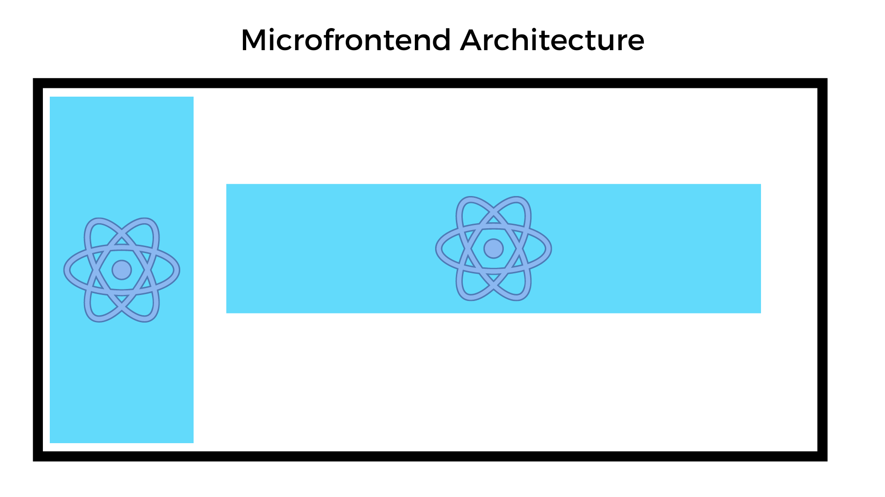

# Ejemplo de implementacion de MicroFrontends con React JS





## Run container

```
cd container

npm i && npm run build && npm run serve // running in port 3001
```

## Run banner

```
cd container

npm i && npm run build && npm run serve // running in port 3000
```